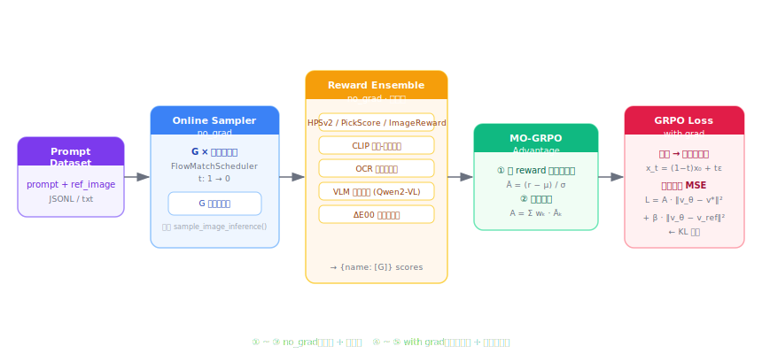

# GRPO 方法：musubi-tuner 在线 RL 训练框架

**2026-06-10**

---

## 1. 问题定义

### 1.1 Off-Policy 方案的根本局限

Off-Policy Sample-Weight 方案（已实现）确立了一个有效的基本原则：对不同质量的样本赋予不同的损失权重。它的问题是**权重在训练前就固定了**——它能引导模型更专注于哪类样本，但无法主动要求模型生成"更好"的内容。

更重要的是，Off-Policy 方案依赖真实样本，而真实样本是有限的：训练集里的样本数量固定，质量边界固定。如果训练目标是让模型生成质量突破训练集上界的内容，Off-Policy 方案就到了它的边界。

### 1.2 在线 RL 的核心能力

GRPO（Group Relative Policy Optimization）的根本思路不同：

```
Off-Policy:  评估已有样本的难度 → 权重 → 影响学习
Online RL:   模型主动生成候选 → 奖励 → 优势 → 影响生成方向
```

区别在于，在线 RL 让模型在训练中不断探索，奖励信号直接塑造生成倾向，理论上能突破训练集的质量上限。

### 1.3 Flow Matching 模型的特殊挑战

将 RL 套到 Flow Matching 模型上有几个非显然的困难：

| 挑战 | 说明 |
|---|---|
| **连续动作空间** | 模型每步输出的是连续速度场，不是离散 token，无法直接套 PPO 策略比 |
| **长步骤依赖** | 一次生成 = T 步去噪，每步输出都影响最终图像，但奖励只在终点计算 |
| **Reward Hacking** | 单一奖励模型极易被过拟合：模型会学到奖励模型的盲点而不是真实质量提升 |
| **量纲不齐** | 不同奖励（HPSv2 值域 ≈ 0.2，CLIP ≈ 0.3，ΔE00 ≈ -10）直接相加，高方差奖励劫持训练 |

### 1.4 设计目标

- **Flow Matching 原生**：损失直接在速度场空间计算，不引入代理近似
- **多奖励防 Hacking**：各奖励先组内归一化，再加权聚合，权重真实反映人的偏好比例
- **与现有框架完全解耦**：不修改任何现有训练文件，独立模块插入
- **架构无关**：通过接口代理支持所有 musubi-tuner 架构

---

## 2. 整体设计

### 2.1 两阶段流水线



每个训练 step 分为严格的两个阶段：

```
Phase 1（no_grad）
  ─────────────────────────────────────────────────────
  for 每条 prompt × G 次:
    do_inference() → 生成图像 PIL               # 复用架构原有推理
  
  for 每个 reward:
    reward.score(images, prompts) → [B·G]       # 懒加载，score 完放回 CPU
  
  compute_group_advantages(scores, weights, G)   # 组内归一化
  ─────────────────────────────────────────────────────
  结果：advantages [B·G]，不携带梯度

Phase 2（with_grad）
  ─────────────────────────────────────────────────────
  vae.encode(images) → latents [B,C,F,H,W]       # 重新编码为训练 latent
  scale_shift_latents(latents)                    # 架构相关归一化
  
  t ~ Uniform[0,1];  x_t = (1-t)·x₀ + t·ε
  v_target = ε − x₀
  
  call_dit(transformer, x_t, t, batch) → v_θ     # 前向传播，携带梯度
  call_dit(ref_transformer, x_t, t, batch) → v_ref  # 参考策略，no_grad
  
  L = mean( A · ||v_θ − v_target||² ) + β · mean( ||v_θ − v_ref||² )
  ─────────────────────────────────────────────────────
  结果：scalar loss，携带梯度，可直接 backward()
```

### 2.2 Group 采样与优势计算

对同一条 prompt 采样 G 张图像，以**组内均值**作为奖励基准：

```
reward_i → advantage_i = reward_i − mean_group(reward)
```

这个设计的关键特性是**自适应难度消除**：对容易的 prompt，G 张图像质量都高，均值也高，优势仍是有意义的相对分；对难的 prompt，G 张图像质量都低，但高于均值的样本仍会得到正优势。不同 prompt 之间的难度差异不会混入梯度信号。

### 2.3 MO-GRPO 多奖励归一化（核心设计）

多奖励直接加权求和的问题：

```
A = Σ_k w_k · r_k

# 若 r₁ ∈ [0.15, 0.25]（CLIP），r₂ ∈ [-15, -2]（ΔE00）
# r₂ 的绝对方差远大于 r₁，梯度由 r₂ 主导，w 权重失去意义
```

MO-GRPO 的解法：**先在 group 内归一化，再加权聚合**：

```python
# advantage.py: compute_group_advantages()

r = raw.reshape(B, G)                           # [B, G]
mean = r.mean(dim=1, keepdim=True)              # 组内均值 [B, 1]
std  = r.std(dim=1, keepdim=True, unbiased=False)
r_norm = (r − mean) / (std + eps)              # 每个奖励组内标准化

advantage += w_k * r_norm.reshape(B*G)         # 各奖励贡献量级相同
```

归一化后每个奖励的标准差约为 1，权重 `w_k` 直接等于该奖励在最终优势中的实际比例。

### 2.4 Flow Matching GRPO Loss

Flow Matching 的前向过程：

```
x_t = (1 − t) · x₀ + t · ε,    ε ~ N(0, I),    t ~ Uniform[0, 1]
v_target = ε − x₀               # 标准 FM 速度场目标
```

标准 SFT loss：`L_FM = E[t] ||v_θ(x_t, t, c) − v_target||²`

GRPO loss 在此基础上加入优势权重和 KL 惩罚：

```
L_GRPO = E[i,t] [ A(i) · ||v_θ(xₜ(i), t, c) − v_target(i)||² ]
       + β      · E[t]  [ ||v_θ(xₜ, t, c) − v_ref(xₜ, t, c)||² ]
```

- `A(i)` > 0：该样本的优势为正，鼓励 v_θ 靠近对应的速度场目标
- `A(i)` < 0：该样本优势为负，惩罚 v_θ 朝该方向移动
- 第二项 KL 惩罚：`v_ref` 是训练开始时冻结的参考策略快照，防止策略漂移过远

**关键注意**：`x₀` 是从已生成图像重新编码得到的 latent（不是训练集样本），不携带梯度；`x_t` 是对 `x₀` 加噪后的中间状态，也不携带梯度。梯度只流过 Phase 2 的 DiT 前向传播。

---

## 3. 框架设计

### 3.1 文件结构

**零侵入原则**：不修改任何现有文件，所有新逻辑在独立目录中实现。

```
musubi-tuner/src/musubi_tuner/
├── grpo/                              # 新增目录（不修改任何现有文件）
│   ├── __init__.py
│   ├── config.py                      # GRPOConfig / RewardConfig（dataclass）
│   ├── trainer.py                     # GRPOTrainer 主体
│   ├── advantage.py                   # MO-GRPO 优势计算
│   ├── prompt_dataset.py              # Prompt 数据集（JSONL / txt）
│   └── reward/
│       ├── base.py                    # BaseReward ABC + @register 注册器
│       ├── clip.py                    # CLIP ViT-H-14
│       ├── hps.py                     # HPSv2.1
│       ├── pickscore.py               # PickScore
│       ├── image_reward.py            # ImageReward
│       ├── ocr.py                     # PaddleOCR 文字准确率
│       ├── vlm.py                     # Qwen2-VL 语义评分
│       └── delta_e.py                 # CIEDE2000 色彩保真度
└── grpo_train_network.py              # 新增入口脚本
```

与 Off-Policy 方案的侵入性对比：

| 方案 | 修改现有文件 | 修改行数 |
|---|---|---|
| Off-Policy Sample-Weight | 3 个文件 | 约 30 行 |
| GRPO | 0 个文件 | N/A |

### 3.2 GRPOTrainer：组合而非继承

最核心的架构决策是 `GRPOTrainer` **持有** `NetworkTrainer` 而非继承它：

```python
# ❌ 继承方式（被放弃的方案）
class GRPOTrainer(NetworkTrainer):
    def train_step(self, ...):
        ...
    # 问题：NetworkTrainer 的 train() 主循环难以被覆盖，
    #      架构特定属性会通过 self 隐式传递，
    #      单元测试困难，多架构复用困难

# ✅ 组合方式（实际实现）
class GRPOTrainer:
    def __init__(self, base_trainer: NetworkTrainer, ...):
        self.base = base_trainer         # 持有，不继承
```

这个决策带来的好处：

1. `GRPOTrainer` 的接口是明确的（`step()` 方法），不受任何 `NetworkTrainer` 内部变化影响
2. 所有架构特定操作通过 `self.base.xxx()` 显式调用，调用链可读
3. `base_trainer` 可以是任意架构的 `NetworkTrainer` 子类，GRPO 层不感知架构细节

### 3.3 Reward 注册器

奖励函数通过注册器与名称字符串解耦：

```python
# base.py
_REWARD_REGISTRY: dict[str, type[BaseReward]] = {}

def register(name: str):
    def decorator(cls):
        _REWARD_REGISTRY[name] = cls
        return cls
    return decorator

# clip.py
@register("clip")
class CLIPReward(BaseReward):
    ...

# TOML 中写 name = "clip" → 自动实例化 CLIPReward
```

新增奖励只需要：新建一个文件，实现 `BaseReward.score()`，加 `@register` 装饰器。无需修改任何注册表文件或工厂函数。

### 3.4 动态架构导入

入口脚本通过名称字符串动态导入对应架构的 `NetworkTrainer`：

```python
ARCH_TRAINERS = {
    "hv":          "musubi_tuner.hv_train_network",
    "wan":         "musubi_tuner.wan_train_network",
    "qwen_image":  "musubi_tuner.qwen_image_train_network",
    ...
}

def _import_trainer(architecture: str):
    mod = importlib.import_module(ARCH_TRAINERS[architecture])
    
    # 用 inspect 找该模块中定义的 NetworkTrainer 子类
    # 不用 getattr(mod, "NetworkTrainer") ——该名称可能指向从别处导入的基类
    arch_classes = [
        cls for _, cls in inspect.getmembers(mod, inspect.isclass)
        if issubclass(cls, _BaseTrainer)
        and cls is not _BaseTrainer
        and cls.__module__ == mod.__name__       # 必须是本模块定义的，非导入的
    ]
    return arch_classes[0]
```

`cls.__module__ == mod.__name__` 这个过滤条件是必须的：qwen_image 模块从 `hv_train_network` 导入基类，若不过滤 `__module__`，`getmembers` 会返回基类而非 `QwenImageNetworkTrainer`。

---

## 4. 关键实现

### 4.1 Phase 1：在线采样（_rollout_one）

```python
# trainer.py: _rollout_one()

def _rollout_one(self, sample_parameter, generator):
    transformer = self.accelerator.unwrap_model(self.transformer)
    was_train = transformer.training
    transformer.eval()                          # 推理时关闭 dropout
    
    try:
        video = self.base.do_inference(         # 完全复用架构原有推理代码
            self.accelerator, self.args,
            sample_parameter,                   # 含 prompt embedding、尺寸等
            self.vae, self.dit_dtype,
            transformer,
            discrete_flow_shift, steps,
            width, height, frame_count,
            generator,
            do_classifier_free_guidance=False,  # GRPO 训练中关闭 CFG
            guidance_scale=1.0,
        )
    finally:
        transformer.train(was_train)            # 恢复训练状态
        self.vae.to("cpu")                      # VAE 用完立即卸到 CPU
    
    return video, None                          # latents 不暴露（不需要）
```

两个细节值得注意：
- `do_classifier_free_guidance=False`：GRPO 训练时关闭 CFG，与 RLHF 的通常做法一致，也避免 CFG 扭曲奖励基准
- `vae.to("cpu")`：VAE 在 `do_inference` 内会被移到 GPU，这里需要显式移回，否则 G 次推理后 VAE 和 DiT 同时占用 GPU

### 4.2 Phase 2：VAE 重编码（两种 VAE 家族）

Phase 2 需要将 PIL 图像编码回 latent 进行 DiT 前向传播。musubi-tuner 支持两种 VAE 接口：

```python
# trainer.py: _encode_images_to_latents()

if hasattr(self.vae, "latents_mean"):
    # qwen_image 系 VAE（AutoencoderKLQwenImage）
    # 使用 latents_mean / latents_std 做归一化，不用 config.scaling_factor
    # 输入期望 [0,1] 浮点，内部处理归一化和时间维度
    latents = self.vae.encode_pixels_to_latents(imgs_t)          # [B, C, 1, H, W]
else:
    # diffusers 系 VAE（AutoencoderKL 等）
    imgs_t = imgs_t * 2.0 - 1.0          # [0,1] → [-1,1]
    imgs_t = imgs_t.unsqueeze(2)          # [B,C,H,W] → [B,C,1,H,W]
    latent_dist = self.vae.encode(imgs_t)
    latents = latent_dist.latent_dist.sample()   # 或 .sample()，取决于版本
    
    if getattr(self.vae.config, "shift_factor", None):
        latents = (latents - self.vae.config.shift_factor) * self.vae.config.scaling_factor
    elif getattr(self.vae.config, "scaling_factor", None):
        latents = latents * self.vae.config.scaling_factor
```

VAE 家族检测用 `hasattr(vae, "latents_mean")` 而非类名检查，保证对未来新 VAE 的鲁棒性。

### 4.3 Phase 2：架构无关 batch 构建（_build_batch_dict）

不同架构的 `call_dit` 期望不同的 batch 键：

```python
# trainer.py: _build_batch_dict()

if "vl_embed" in first_sp:
    # qwen_image 架构
    # vl_embed 在 process_sample_prompts 中存储为 [1, L, D]（带 batch 维）
    # call_dit 期望 list of [L, D]，因此需要 squeeze(0)
    vl_list = [
        sample_parameters[idx]["vl_embed"].squeeze(0).to(device)   # [1,L,D] → [L,D]
        for idx in param_indices
    ]
    batch = {"vl_embed": vl_list}

else:
    # HunyuanVideo 系架构
    # llm_embeds / llm_mask / clipL_embeds，长度可能不同，需要 padding
    batch = {
        "llm":      _pad_stack([sp["llm_embeds"] for sp in ...]),
        "llm_mask": _pad_stack([sp["llm_mask"]   for sp in ...]),
        "clipL":    _pad_stack([sp["clipL_embeds"] for sp in ...]),
    }

# qwen_image 的 call_dit 从 batch["latents"] 读取 latent（不从参数读）
if latents is not None:
    batch["latents"] = latents
```

`squeeze(0)` 这个细节值得解释：`process_sample_prompts` 在编码 vl_embed 时保留了 batch 维（`[1, L, D]`），而 `call_dit` 内部用 `x.shape[0]` 作为 text sequence length。若不 squeeze，`shape[0] = 1`（batch 维），导致 txt_query 尺寸错误，attention cat 失败。

### 4.4 KL 惩罚的参考策略冻结

参考策略在 `__init__` 时通过 `copy.deepcopy` 创建，此后完全冻结：

```python
# trainer.py: __init__()

self.ref_transformer = copy.deepcopy(transformer)
self.ref_transformer.requires_grad_(False)
self.ref_transformer.eval()
```

```python
# trainer.py: _grpo_loss()

if self.config.kl_coeff > 0:
    with torch.no_grad():                           # 参考策略不参与梯度
        ref_pred, _ = self.base.call_dit(
            ..., self.ref_transformer, ...          # 用冻结的 ref，不是 self.transformer
        )
    kl_loss = F.mse_loss(
        model_pred.detach() → model_pred,           # 当前策略
        ref_pred.detach(),                          # 参考策略
        reduction="none"
    ).mean() * self.config.kl_coeff
```

MSE 在速度场空间计算 KL 是一种近似（严格的 KL 需要在高斯分布上计算），但在 Flow Matching 上已被证明实用且计算量小。

### 4.5 完整 step() 流程

```python
def step(self, sample_parameters, reference_images=None):
    G = self.config.group_size
    
    # ── Phase 1: 在线采样（no_grad）──────────────────────────
    with torch.no_grad():
        all_images, all_prompts, all_ref_images = [], [], []
        
        for sp in sample_parameters:
            for _ in range(G):
                video, _ = self._rollout_one(sp, generator)
                all_images.append(_video_to_pil(video))
                all_prompts.append(sp["prompt"])
        
        # 逐 reward 打分（懒加载模型，score 后释放）
        scores = {}
        for name, rw, _ in self._named_rewards:
            rw.load(device)
            scores[name] = rw.score(all_images, all_prompts, ...).cpu()
        
        # MO-GRPO 优势
        adv = compute_group_advantages(scores, weight_map, G)    # [B*G]
    
    # ── Phase 2: GRPO loss（with_grad）──────────────────────
    loss, log = self._grpo_loss(all_images, adv, sample_parameters, ...)
    
    return loss, log
```

`step()` 返回一个携带梯度的 scalar tensor，调用方直接 `accelerator.backward(loss)` 即可，与标准训练循环完全一致。

---

## 5. 与 Off-Policy Sample-Weight 的统一视角

两个方法在数学上是**同一结构**：

```
Off-Policy:   loss_i = w_offline(i)  · ||v_θ(x_t) − v_target||²
GRPO:         loss_i = A_online(i)   · ||v_θ(x_t) − v_target||²
```

唯一的区别是损失权重的来源：

| 维度 | Off-Policy Sample-Weight | GRPO |
|---|---|---|
| 权重来源 | 训练前离线计算 | 训练中在线生成 + 奖励打分 |
| 训练样本 | 数据集中的真实样本 | 当前策略生成的合成样本 |
| 反馈延迟 | 静态（手动更新 JSON） | 即时（每 step 更新） |
| 能否突破训练集质量上限 | 否 | 是 |
| 计算开销 | 极低（一次乘法） | 高（G × 完整推理 + 奖励推理） |
| 实现复杂度 | 低（3 文件 8 处改动） | 高（独立模块 ~12 个文件） |
| 适用阶段 | SFT 增强 | 对齐训练（RL fine-tuning） |

两者**正交**，可以同时使用：用 Off-Policy 权重做课程采样，同时用 GRPO 做在线对齐。

---

## 6. 注意事项

### 6.1 group_size 的下界

`compute_group_advantages` 在 group 内计算标准差。当 `group_size = 1` 时，std = 0，所有 advantage = 0，梯度消失。实践中 `group_size ≥ 2`，推荐 4~8。

### 6.2 奖励方差与 advantage 的关系

若 group 内所有图像的奖励得分几乎相同（如生成早期模型输出全是噪声，CLIP 分全部极低），`std ≈ 0`，归一化后的 advantage 趋向 0，训练停滞。此时应检查推理步数是否太少（`num_inference_steps < 5` 时生成图像可能质量无差异），或暂时降低 `kl_coeff` 让策略先有足够自由度探索。

### 6.3 参考策略更新

当前实现中参考策略在整个训练过程中保持初始快照不变。若训练轮数较长（> 500 step），策略漂移可能导致 KL 项持续增大而不收敛。可以考虑每隔 N 步用 Polyak 平均更新参考策略：

```python
# 未内置，需要手动添加
tau = 0.005
for p_ref, p_cur in zip(ref_transformer.parameters(), transformer.parameters()):
    p_ref.data.mul_(1 - tau).add_(tau * p_cur.data)
```

### 6.4 VAE 显存管理

每次 Phase 1 推理后 VAE 会被主动移回 CPU（`vae.to("cpu")`）。Phase 2 编码时再次移到 GPU，编码完成后再移回 CPU。这会有约 1~2 秒的 host-device 传输开销，但能避免 DiT（39GB+）和 VAE 同时占用 GPU。若显存充足，可去掉这个来回移动。

### 6.5 架构特定注意事项

**qwen_image**：

- 必须传 `--model_version`（如 `edit-2511`），否则 `handle_model_specific_args` 无法推断 `is_edit`/`is_layered`
- 不支持 `attn_mode = "sdpa"`，默认改用 `"torch"`；需要加速时用 `--flash_attn`
- 文本编码器参数名是 `--text_encoder`，不是 `--text_encoder1`

**HunyuanVideo / Wan / FramePack**：

- 需要两个文本编码器（`--text_encoder1` + `--text_encoder2`）或一个（`--text_encoder1`）
- `discrete_flow_shift` 对这些架构取 `14.5`（HunyuanVideo）或 `3.0`（Wan）
