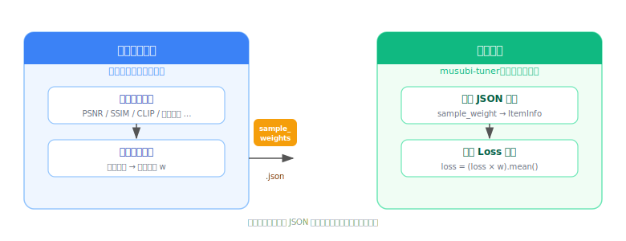

# Off-Policy Sample-Weight Method：musubi-tuner 框架扩展方案

**2026-06-05**

---

## 1. 问题定义

### 1.1 核心问题

在图像/视频生成模型的微调任务中，**不同样本的学习价值并不均等**：

- **简单样本**：模型已经能很好地重建，继续训练这些样本的收益很低
- **困难样本**：模型重建质量差，但这些样本恰恰蕴含了模型需要学习的关键特征

如何在训练过程中让模型更多地"关注"困难样本，是提升训练效率的关键。

### 1.2 传统做法及其局限

#### 方法 A：数据复制（Data Duplication）

将困难样本复制多份，使模型在每个 epoch 中多次见到这些样本。

| 缺点 | 说明 |
|---|---|
| 权重粗糙 | 只能做整数倍加权（1×、2×、3×），无法精细调控 |
| 磁盘膨胀 | cache 目录线性增长，每份副本都占独立的磁盘空间 |
| 训练变慢 | 每 epoch 步数 = 原始数据量 × 平均复制倍数 |
| 维护困难 | 新增样本时需要重新规划复制策略 |
| 无负反馈 | 模型学会了某个样本后，其副本仍在参与训练，浪费计算 |

#### 方法 B：Curriculum Learning / Online Hard Mining

训练过程中动态计算每个样本的 loss，对高 loss 的样本赋予更大权重。

| 缺点 | 说明 |
|---|---|
| 实现复杂 | 需要修改 DataLoader 的采样逻辑 |
| 计算开销 | 每个 step 都需要额外的 loss 统计 |
| 不稳定 | loss 高 ≠ 样本难（可能是噪声或标注错误） |
| 框架侵入性大 | 对训练循环有较深的依赖 |

### 1.3 理想方案

- 困难度评估与训练过程**解耦**：用离线指标度量样本难度，训练时只消费结果
- 权重**连续可调**：浮点权重而非整数倍复制
- 框架**最小侵入**：不改变 DataLoader 的采样策略，只在 loss 计算时加权
- **指标无关**：任何能反映样本难度的离线指标都可以作为输入

---

## 2. 方案设计

### 2.1 核心思路



> 离线阶段（蓝）与训练阶段（绿）通过 `sample_weights.json` 连接，两侧策略完全独立。

**关键解耦：** 离线阶段产出 `sample_weights.json`，训练阶段消费它。两个阶段通过一个标准化的 JSON 协议连接。

### 2.2 权重文件格式（协议约定）

```json
{
  "sample_stem_001": 2.5,
  "sample_stem_002": 1.0,
  "sample_stem_003": 7.3,
  ...
}
```

- **Key**：样本的文件 stem（文件名不含扩展名），需与训练数据集的缓存文件名对应
- **Value**：浮点权重，1.0 为基准，大于 1.0 表示困难样本

### 2.3 离线权重生成（指标无关）

权重生成不绑定任何特定指标。只要你能计算出每个样本的某种"难度得分"，就可以映射为权重。常见的映射函数：

| 映射函数 | 公式 | 适用场景 |
|---|---|---|
| **线性** | `w = 1 + α × max(0, s − τ)` | 得分与难度线性相关 |
| **平方根** | `w = 1 + α × √max(0, s − τ)` | 得分差异大，需要平滑 |
| **对数** | `w = 1 + α × ln(1 + max(0, s − τ))` | 得分范围极宽 |
| **分位数** | `w = 1 + α × rank(s) / N` | 只关心相对排序 |

其中 `s` 是样本的难度得分，`τ` 是阈值（低于此值的样本不加强），`α` 是强度系数。

### 2.4 训练时消费

```bash
accelerate launch src/musubi_tuner/hv_train_network.py \
    --sample_weight_file sample_weights.json \
    --sample_weight_multiplier 1.0 \
    ...
```

- `--sample_weight_file`：权重 JSON 文件路径（不传则所有样本权重为 1.0，等同原版行为）
- `--sample_weight_multiplier`：全局倍率（用于实验调参，乘以所有权重）

---

## 3. 框架修改

### 3.1 修改概览

对 musubi-tuner 的修改涉及 3 个文件，共 8 处改动。所有改动**向后兼容**：不传 `--sample_weight_file` 时，行为与原版完全一致。

```
musubi-tuner/src/musubi_tuner/
├── dataset/
│   ├── config_utils.py              # 2 处：参数定义 + schema 注册
│   └── image_video_dataset.py       # 4 处：数据结构 + 加载 + 打包
└── hv_train_network.py              # 2 处：loss 计算 + argparse
```

### 3.2 详细改动

#### (1) 数据结构扩展：`image_video_dataset.py`

**原版 ItemInfo：**
```python
class ItemInfo:
    def __init__(self, ...):
        self.item_key = item_key
        self.caption = caption
        ...
        # 无样本权重概念
```

**修改后：**
```python
class ItemInfo:
    def __init__(self, ...):
        self.item_key = item_key
        self.caption = caption
        ...
        # 新增：样本权重，默认 1.0
        self.sample_weight: float = 1.0
```

#### (2) 数据集初始化：`image_video_dataset.py` — `ImageDataset`

**原版：**
```python
class ImageDataset(BaseDataset):
    def __init__(self, ..., debug_dataset=False, architecture="no_default"):
        ...
```

**修改后：**
```python
class ImageDataset(BaseDataset):
    def __init__(self, ..., sample_weight_file=None, debug_dataset=False, architecture="no_default"):
        ...
        self.sample_weight_file = sample_weight_file
```

#### (3) 训练准备阶段：`image_video_dataset.py` — `prepare_for_training`

**原版：**
```python
def prepare_for_training(self, num_timestep_buckets=None):
    # 遍历 cache 文件，构建 ItemInfo，无权重逻辑
    for cache_file in latent_cache_files:
        item_info = ItemInfo(item_key, "", image_size, bucket_reso, ...)
        ...
```

**修改后：**
```python
def prepare_for_training(self, num_timestep_buckets=None):
    # 新增：加载权重文件
    sample_weights = {}
    if self.sample_weight_file:
        with open(self.sample_weight_file) as f:
            sample_weights = json.load(f)
        logger.info(f"Loaded {len(sample_weights)} sample weights from {self.sample_weight_file}")

    for cache_file in latent_cache_files:
        item_info = ItemInfo(item_key, "", image_size, bucket_reso, ...)
        # 新增：赋予样本权重
        if sample_weights:
            item_info.sample_weight = sample_weights.get(item_key, 1.0)
        ...
```

#### (4) Batch 构建：`image_video_dataset.py` — `BucketBatchManager`

**原版：**
```python
def get_batch(self, ...):
    ...
    batch_tensor_data["timesteps"] = timesteps
    # batch 中只有图像/视频/latent 等数据，无权重信息
    return batch_tensor_data
```

**修改后：**
```python
def get_batch(self, ...):
    ...
    batch_tensor_data["timesteps"] = timesteps
    # 新增：将每个样本的权重打包进 batch
    sample_weights = [
        getattr(item_info, "sample_weight", 1.0)
        for item_info in bucket[start:end]
    ]
    batch_tensor_data["sample_weight"] = torch.tensor(sample_weights, dtype=torch.float32)
    return batch_tensor_data
```

#### (5) 配置 schema：`config_utils.py`

**原版 `ImageDatasetParams`：**
```python
@dataclass
class ImageDatasetParams(BaseDatasetParams):
    image_directory: Optional[str] = None
    ...
    control_resolution: Optional[Tuple[int, int]] = None
    # 无 sample_weight_file
```

**修改后：**
```python
@dataclass
class ImageDatasetParams(BaseDatasetParams):
    image_directory: Optional[str] = None
    ...
    control_resolution: Optional[Tuple[int, int]] = None
    sample_weight_file: Optional[str] = None  # 新增
```

同时 `IMAGE_DATASET_DISTINCT_SCHEMA` 新增：
```python
IMAGE_DATASET_DISTINCT_SCHEMA = {
    ...
    "sample_weight_file": str,  # 新增
}
```

#### (6) 训练循环 loss 计算（核心改动）：`hv_train_network.py`

**原版：**
```python
# loss shape: [B, C, H, W] 或 [B, T, C, H, W]
loss = loss.mean()  # 所有样本、所有空间维度直接平均
```

**修改后：**
```python
if "sample_weight" in batch:
    # Step 1: 空间维度求平均 → per-sample loss，shape: [B]
    loss = loss.mean(dim=list(range(1, loss.ndim)))
    # Step 2: 乘以样本权重
    sample_w = batch["sample_weight"].to(loss.device, loss.dtype) \
               * args.sample_weight_multiplier
    loss = (loss * sample_w).mean()
else:
    # 无权重文件时，行为与原版一致
    loss = loss.mean()
```

#### (7) 命令行参数：`hv_train_network.py` — `setup_parser_common`

**原版：** 无相关参数

**新增：**
```python
parser.add_argument(
    "--sample_weight_file",
    type=str, default=None,
    help="Path to JSON file mapping sample stems to weights (for per-sample weighted loss)",
)
parser.add_argument(
    "--sample_weight_multiplier",
    type=float, default=1.0,
    help="Global multiplier for sample weights (default: 1.0)",
)
```

---

## 4. 使用示例

### 4.1 通用流程

```
步骤 1: 用你的方式评估每个样本的难度
        → 产出: {sample_stem: difficulty_score}

步骤 2: 映射为权重
        → 产出: sample_weights.json

步骤 3: 训练时指定
        → --sample_weight_file sample_weights.json
```

### 4.2 不同任务场景的权重来源

| 任务 | 难度指标示例 | 评估方式 |
|---|---|---|
| 图像修复 | PSNR / SSIM / LPIPS | 对比修复结果与 GT |
| 图像编辑 | CLIP 语义一致性 | 编辑指令 vs 编辑结果的 CLIP 相似度 |
| 超分辨率 | HR-LR 重建误差 | 降采样后超分，对比原始 HR |
| 风格迁移 | 风格损失 + 内容损失 | 特征空间的 Gram 矩阵差异 |
| 任意任务 | 人工标注难度等级 | 标注员打分 → 映射为权重 |

### 4.3 权重生成脚本模板

```python
import json
from pathlib import Path

# ---- 替换为你的评估逻辑 ----
def evaluate_difficulty(sample_path: Path) -> float:
    """返回样本难度得分（越高越难）"""
    # 你的评估代码
    ...
    return score

# ---- 替换为你的映射函数 ----
def score_to_weight(score: float) -> float:
    """难度得分 → 训练权重"""
    threshold = 3.0
    alpha = 0.3
    max_w = 10.0
    excess = max(0.0, score - threshold)
    return min(1.0 + alpha * excess, max_w)

# ---- 生成权重文件 ----
weights = {}
for sample in Path("your_dataset").glob("*.png"):
    score = evaluate_difficulty(sample)
    weights[sample.stem] = round(score_to_weight(score), 4)

with open("sample_weights.json", "w") as f:
    json.dump(weights, f, indent=2)
```

---

## 5. 与数据复制方案的对比

| 维度 | 数据复制 | Off-Policy 样本加权 |
|---|---|---|
| 磁盘占用 | N × 原始数据 | 1 × 原始数据 + 1 个 JSON 文件 |
| 每 epoch 步数 | N × 原始步数 | 等于原始步数 |
| 权重精度 | 整数（1×、2×、...） | 任意浮点数 |
| 训练速度 | 与数据量成正比变慢 | 不变（仅 loss 计算多一次乘法） |
| 调参灵活性 | 需要重新生成数据 | 改 JSON 文件即可，零成本 |
| 框架侵入性 | 无（纯数据层面） | 需修改 3 个文件 |
| 缓存管理 | 复杂（副本与原始数据混合） | 简单（一套 cache） |
| 可复现性 | 依赖数据生成脚本 | JSON 文件可直接提交到版本控制 |

---

## 6. 注意事项

1. **权重与 loss 绝对值的关系：** 加权后的 loss 绝对值会比不加权时高（因为困难样本被放大），两者不可直接比较
2. **权重更新时机：** 当前方案是静态权重（训练前计算一次）。如果模型能力显著提升，可以重新跑评估脚本生成新的权重文件
3. **未覆盖的样本：** JSON 中没有出现的样本 stem 默认取 weight=1.0，不会报错
4. **Video dataset 支持：** 当前改动仅覆盖 `ImageDataset`，`VideoDataset` 如需支持需做类似扩展
5. **多数据集混合：** 每个 dataset 可以指定不同的 `sample_weight_file`，也可以不指定（全部 weight=1.0）
